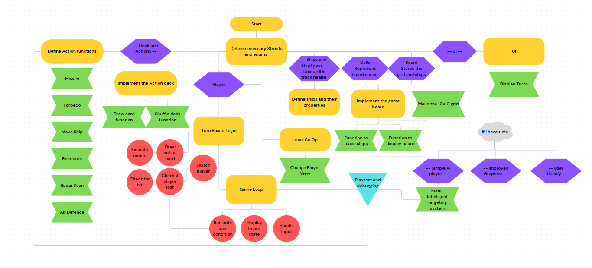

# Battleship 
## Preplanning
### What is Battleships

  Battleships is a two player game played on four 10x10 grids, two each one horizontal for your ships and opponents guesses and the other for your guesses. It begins with each player placing their battleship then each player places ships until they have five each. The Game begins with a player guessing a Cordonate on the grid and anoucing it to their opponent, the opponent will respond with either a hit or a miss which current player will record on their verticle grid, the next player now has their turn. This is repeated until all ships are sunk which occurs when all of the positions it takes up have been hit. 

### The History of Battleships

  Origionating from the early 1900s Battleships began as a game played with pen and paper. The first Published version of Battleships was in 1931 under the name "Salvo" by Starex Novelty co., still played with paper and pen but now with specifically printed pads to play on. Unlike today each player had as many shots as they did ships with some variations giving specific ships two shots. Once a player has anounced all shots the other would respond by saying how many shots hit and what was hit, without revealing which shot did which. Later in the 30s and 40s it was published again under other names such as Combat: The Battleship Game and Broadside: A Game of Naval Strategy. In 1967 Battleship was released by Milton Bradly and looked very similar to how it does today, now made of plastic containing small peices to signify ships, hits, misses aswell as the boards one horizontal to house your ships and another for your guesses. In the 80s and 90s new versions of the game and spin-offs were released and it was adapted into video games, anb in 2012 it was even made into a feature film.
  
### My Twist

  So what is my twist? Well instead of you just been able to fire at the enemy you will instead draw from the deck and be able to select what action you wish to do from your hand. These new actions will, shot two missles in a staight line from the side of the board until it hits something ("Torpedo"), move the ship 1 space in any direction (Patrol), extra hit point (Reinforce), reveal part of the enemies board (Radar Scan) and prevent the enemie from shotting next turn (air defence).

### Flowchart



### Timeline 
Please see https://github.com/BattleDemon/Battleships/blob/main/timeline.md

### If I get more time

  If i finish my game before it is due I will attempt to add a very simple AI to the game which will be more than a random number generater. Another thing I could do is improve the graphics or making it more user friendly.

## Prototyping 
### Prototype 1: Basic game loop 
#### Code at March 24th 
To view all code at this point please see https://github.com/BattleDemon/Battleships/blob/Prototypes/Prototype1.rs

Main Loop
```rs
    let mut player1_turn = true;
    loop {
        clear_background(BLACK);

        if player1_turn == true {
            player1.boardgrid.draw();
            player1.guessgrid.draw();
        }
        else {
            opponent.boardgrid.draw();
            opponent.guessgrid.draw();
        }
        
        if is_key_pressed(KeyCode::A) {

            let nums: Vec<usize> = (0..10).collect();
                let mut rng = ::rand::rng();
                let tempx = nums.choose(&mut rng);
                let tempy = nums.choose(&mut rng);
                let x: usize = *tempx.unwrap();
                let y: usize = *tempy.unwrap();

            if player1_turn == true {
                player1.fire_missile(&mut opponent,x,y);
                
            }
            else {
                opponent.fire_missile(&mut player1,x,y)
            }
            player1_turn = !player1_turn;
        }

        if is_mouse_button_pressed(MouseButton::Left) {
            if player1_turn {
                if let Some((x, y)) = player1.get_clicked_cell() {
                    player1.fire_missile(&mut opponent, x, y);
                    player1_turn = false;
                }
            } else {
                if let Some((x, y)) = opponent.get_clicked_cell() {
                    opponent.fire_missile(&mut player1, x, y);
                    player1_turn = true;
                }
            }
        }

        next_frame().await
    }
}
```

Change Cell function
```rs
fn change_cell(&mut self, x:usize,y:usize,ctype:Cells,grid:&mut Grid) {

        if self.cells[x][y] != Cells::Hit {
            match ctype {
                Cells::Empty => grid.color_cell(x,y ,BLACK),
                Cells::Occupied => grid.color_cell(x,y,GREEN),
                Cells::Hit => grid.color_cell(x, y, RED),
                Cells::Miss => {grid.set_cell_text(x,y, Some("0"));
                                grid.color_cell(x,y,GRAY); },
            }
            self.cells[x][y] = ctype;
        }  
```

Fire Missle and get clicked cell Functions
```rs
fn fire_missile(&mut self, opponent: &mut Player , target_x: usize, target_y: usize) {
        // create local mutable cell for both self and your opponent
        let cell = &mut self.guess_board.cells[target_x][target_y];
        let ocell = &mut opponent.board.cells[target_x][target_y];

        // Check if your opponents cell is occupied if so then muts it to be a hit
        if *ocell == Cells::Occupied {
            self.guess_board.change_cell(target_x, target_y, Cells::Hit, &mut self.guessgrid);
            opponent.board.change_cell(target_x,target_y,Cells::Hit,&mut opponent.boardgrid);
            println!("Hit!");
        } else { // muts it to be a miss
            self.guess_board.change_cell(target_x,target_y,Cells::Miss,&mut self.guessgrid);
            opponent.board.change_cell(target_x,target_y,Cells::Miss,&mut opponent.boardgrid);
            println!("Miss!");
        }
    }

fn get_clicked_cell(&self) -> Option<(usize, usize)> {
        let (mouse_x, mouse_y) = mouse_position();
        
        let grid_x_offset = 710.0;
        let grid_y_offset = 50.0;
        let cell_size = 40.0;  // This should match your grid cell size
        let grid_size_px = cell_size * GRID_SIZE as f32;
    
        // Check if the mouse is within the bounds of the grid
        if mouse_x >= grid_x_offset && mouse_x < grid_x_offset + grid_size_px &&
           mouse_y >= grid_y_offset && mouse_y < grid_y_offset + grid_size_px {
            // Swap x and y calculation to fix the issue
            let x = ((mouse_y - grid_y_offset) / cell_size) as usize;  // Use mouse_y for x
            let y = ((mouse_x - grid_x_offset) / cell_size) as usize;  // Use mouse_x for y
            return Some((x, y));
        }
    
        None
    }
```
#### Video of Functionality (link to youtube)
[](https://www.youtube.com/watch?v=NM8lwhZ-a-o)
#### Issues and Solutions 

### Prototype 2: Added Torpedo and Radar scan actions and random ship placement
#### Code at March 27th 
To view all code at this point please see 

Main Loop
```rs

```

Torpedo Function
```rs

```

Radarscan Function
```rs

```

Random Ship Placement
```rs

```

#### Video of Functionality 

#### Issues and Solutions 

### Prototype with Ui and visuals
#### Code at March 30th 

#### Video of Functionality 

#### Issues and Solutions 

### Prototype with all system but needing balancing
#### Code at April 3rd 

#### Video of Functionality 

#### Issues and Solution

## Reflecting 
### How is the overall desing 

### What Changes could I make

### What issues did I encounter

### How were these issues solved

### What would I do if I were to do this again

### What have I learnt 

